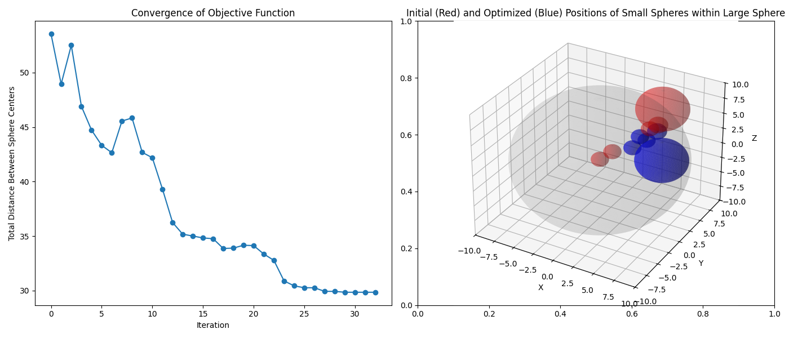

# Collection of code developed for AST-4104-01

Includes Modified Hypersonic Aerospace Sizing Analysis (HASA) and Layout Optimization Code.

## Modified HASA Weight Analysis Test
Original HASA Paper can be found here: https://ntrs.nasa.gov/api/citations/19890005736/downloads/19890005736.pdf

Various sources for modified HASA can be found here: https://s-space.snu.ac.kr/handle/10371/196316, https://s-space.snu.ac.kr/bitstream/10371/196316/1/000000178869.pdf 

For the sample script in `hasa.py`, X-37B dimensions are used. When certain dimensions aren't available online, estimated quantities derived from a fairly accurate CAD model are used.

The total weight is available online; the propellant weight is deduced from a final project for a graduate course at University of Colorado Boulder (ASEN 5053 Rocket Propulsion): https://www.colorado.edu/faculty/kantha/sites/default/files/attached-files/final_project_johnson.pdf

## Layout Optimization
Based on the amazing AeroSandbox library: https://github.com/peterdsharpe/AeroSandbox
